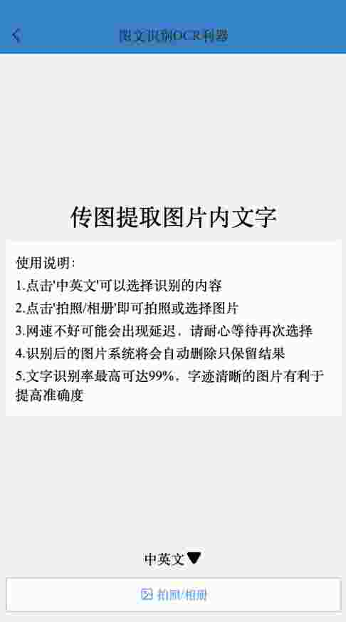
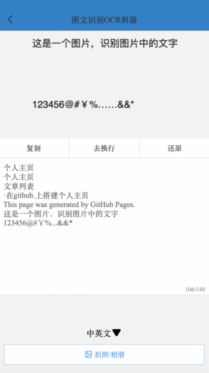
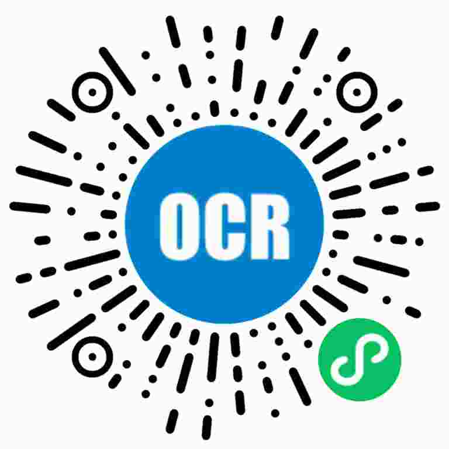

# 然部落-Ocr

基于hyperf + uni-app开发，多端的图片文字识别工具


## 展示





微信搜索：图文识别OCR利器

或扫描以下二维码：



有问题提`issue`

## 前端

前端存放目录：./app

导入`HBuilderX`运行

复制文件`config.example.js`出来命名为`config.js`

## 服务端

服务端存放目录：./api

### 版本

PHP >= 7.3 

Composer >= 2

### 部署

1. 拉取代码,进入项目目录

2. 复制文件`.env.example`出来并命名`.env`; 按需修改`.env`中的配置，比如数据库，redis,项目命，百度api密钥等

3. 安装组件库: `composer install`


### 启动项目

``` 
# 启动
./bin/server.sh start

# 停止
./bin/server.sh stop

# 重启
./bin/server.sh restart
```